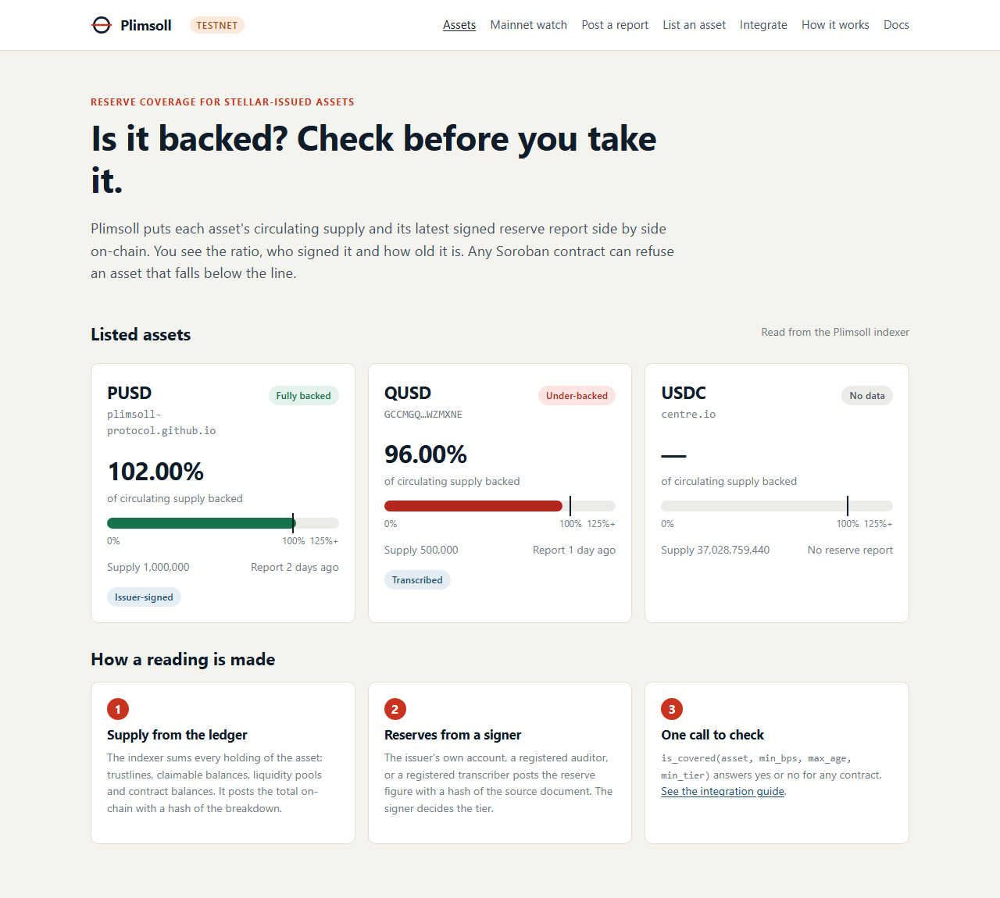
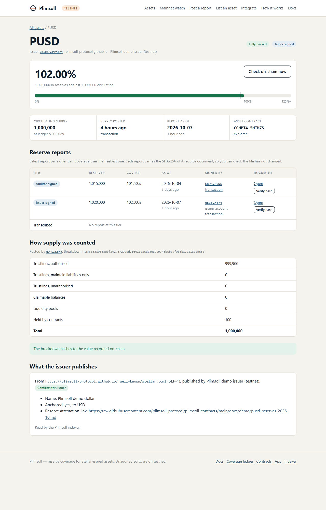
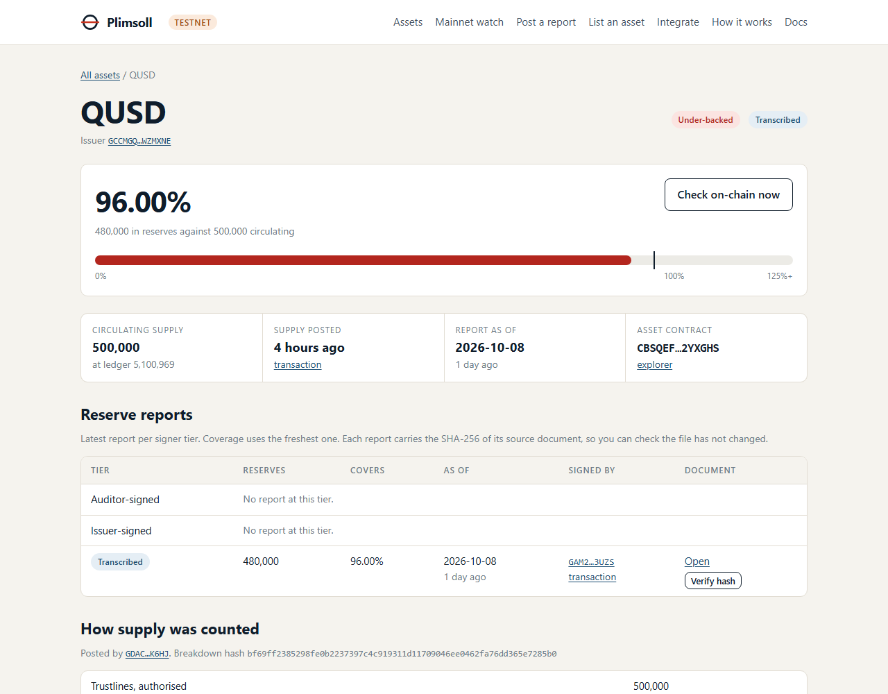
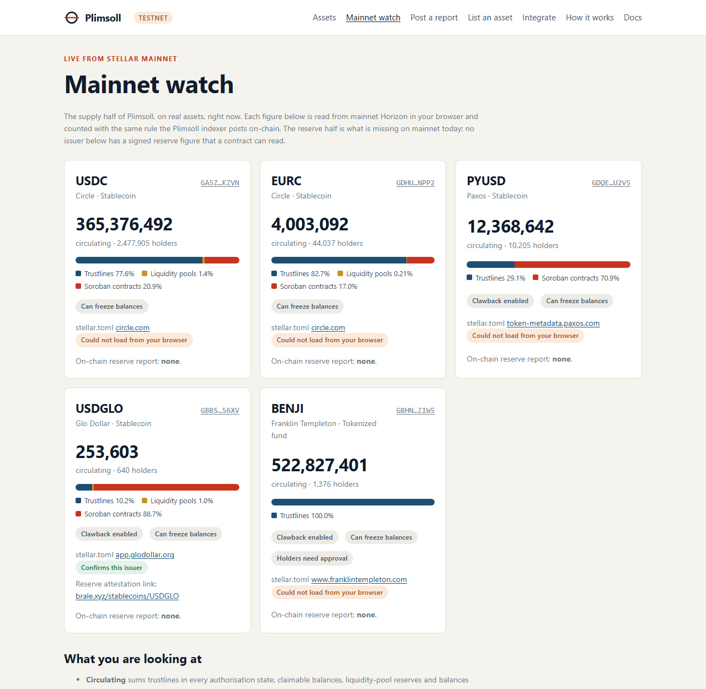
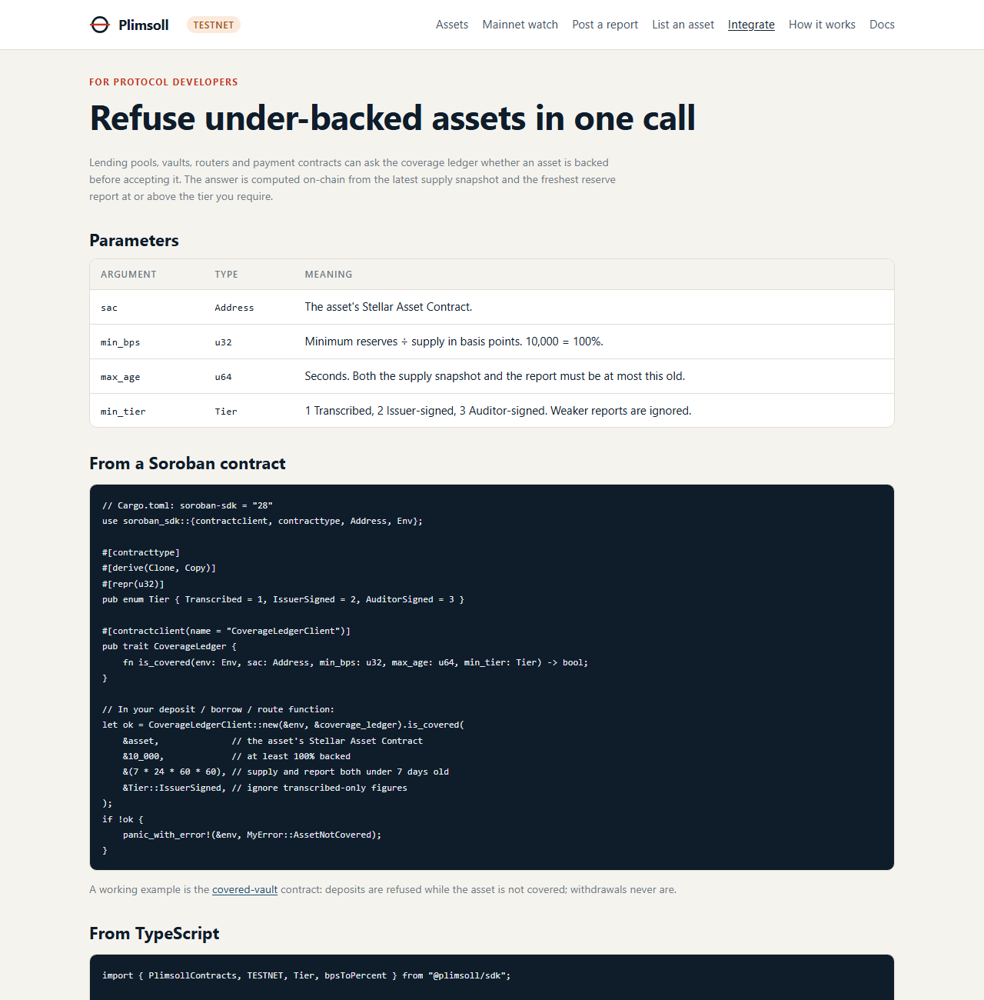

# Reviewer walkthrough

Five minutes, no wallet needed. Every step below is something you can repeat
on the live app; the screenshots were taken from it on 7 October 2026.

**Live app:** [plimsoll-app-gths-amber.vercel.app](https://plimsoll-app-gths-amber.vercel.app/)

## 1. See which assets are backed

Open the [dashboard](https://plimsoll-app-gths-amber.vercel.app/). Each listed
asset shows its coverage ratio, who signed the reserve figure, and how old it is.
Three listed assets show the three outcomes. PUSD reads **102.00%**,
issuer-signed. QUSD reads **96.00%**: it is under-backed, and its figure was
copied from a published statement by a registered transcriber, the lowest tier.
Testnet USDC is listed and its supply is tracked, but no one has posted
reserves for it, so it reads "No data". Plimsoll never guesses.



## 2. Check one asset yourself

Open [PUSD](https://plimsoll-app-gths-amber.vercel.app/asset/?sac=CCHPT4TEJDPZQDSUVW3NP6A35ROGV4WEFZKT45SKWYCFZSUB7R5HIM7S).
Everything on this page can be verified without trusting Plimsoll:

* **Check on-chain now** calls the coverage ledger contract from your browser
  and returns the same ratio, plus `is_covered(100%, 31 days) = true`.
* **Verify hash** downloads each reserve document and compares its SHA-256 with
  the hash stored on-chain.
* **How supply was counted** shows the six buckets the indexer summed. The
  100 PUSD in "Held by contracts" is a deposit in the example vault. The page
  confirms the breakdown hashes to the value posted on-chain.
* **What the issuer publishes** follows the issuer account's `home_domain` to
  its SEP-1 `stellar.toml`, which confirms the issuer and links the reserve
  statement.



## 3. Watch a contract refuse an under-backed asset

Open [QUSD](https://plimsoll-app-gths-amber.vercel.app/asset/?sac=CBSQEFG73RMUVEZ56EFEBCJ23WZNF6FFYXEAJKYG6SZCLKDZ5B2YXGHS).
Its 500,000 units are backed by 480,000 in reserves, so coverage is 96% and
`is_covered(QUSD, 100%, 31 days, any tier)` returns **false**. A second example
vault accepts only fully backed assets, so it refuses a real deposit:

```bash
stellar contract invoke --network testnet --source <any-QUSD-holder>   --id CBURLBHWLWOTKJ5NVF574NAYFM7Y25JB366ZDO7WGJXCVC4C72UVKTO5 --   deposit --from <holder> --amount 1000000000
# error: HostError: Error(Contract, #2)   <- NotCovered: the vault refused QUSD
```

Nothing is transferred; the holder keeps their QUSD. The same call against the
PUSD vault succeeds ([transaction](https://stellar.expert/explorer/testnet/tx/f86eecaa2eb6252bd4e79708966fc510573b8a9878771641b8f8b514d2804b5b)).
The whole demo is reproducible with
[`scripts/seed-underbacked-demo.sh`](https://github.com/plimsoll-protocol/plimsoll-contracts/blob/main/scripts/seed-underbacked-demo.sh).



## 4. See the problem on mainnet, today

Open [Mainnet watch](https://plimsoll-app-gths-amber.vercel.app/mainnet/). It
reads five real assets (USDC, EURC, PYUSD, USDGLO, BENJI) live from mainnet
Horizon and counts supply with the same rule the indexer posts on-chain. About
353 million USDC circulate on Stellar, and between 17% and 89% of four of these
assets sits inside Soroban contracts. Only one of the five publishes a reserve
attestation link, and none has a figure a contract can read. That gap is what
Plimsoll fills.



## 5. See how a protocol uses it

Open [Integrate](https://plimsoll-app-gths-amber.vercel.app/integrate/). One
cross-contract call, `is_covered(asset, min_bps, max_age, min_tier)`, lets a
lending pool or vault refuse an under-backed or stale asset. The
[covered-vault](https://github.com/plimsoll-protocol/plimsoll-contracts/tree/main/contracts/covered-vault)
contract does exactly this on testnet: deposits are checked, withdrawals are
never blocked
([gated deposit transaction](https://stellar.expert/explorer/testnet/tx/f86eecaa2eb6252bd4e79708966fc510573b8a9878771641b8f8b514d2804b5b)).



## 6. Verify from the command line

Same answer, straight from the contract:

```bash
stellar contract invoke --network testnet --send=no \
  --id CC2QQ7R4FLPHZP7KA5AO4IASXXICTG6N4GQXCXITTEBNYQEYTYXKMN4D -- \
  coverage --sac CCHPT4TEJDPZQDSUVW3NP6A35ROGV4WEFZKT45SKWYCFZSUB7R5HIM7S --min_tier 1
```

```json
{"bps":10200,"report_as_of":1791331200,"reserves":"10200000000000","supply":"10000000000000","supply_ledger":5059029,"supply_timestamp":1791318737,"tier":2}
```

And the indexer's live API:
[plimsoll-indexer.onrender.com/v1/assets](https://plimsoll-indexer.onrender.com/v1/assets).

## Key transactions

| What | Transaction |
| --- | --- |
| Supply posted by the indexer | [c3ae90c4…](https://stellar.expert/explorer/testnet/tx/c3ae90c40b1dbf0575e0e9babaefd9ae20dee457fb5b37d2d40105f005f6b81b) |
| Issuer-signed reserve report (7 Oct) | [e0b4df27…](https://stellar.expert/explorer/testnet/tx/e0b4df27bae257a8360a4a62d2efd4a770243faab7673c4d6737305fe548312c) |
| Issuer sets its SEP-1 home domain | [99b28667…](https://stellar.expert/explorer/testnet/tx/99b286676f578c6e2e87bb61c428808ea791b55e121efafaad1934717801cba4) |
| QUSD reserves posted by a transcriber (96%) | [1578741c…](https://stellar.expert/explorer/testnet/tx/1578741c9e185f8ecd276c9ee35f56de6f992ac26a3ebe997066092a1a01c9af) |
| Vault deposit gated by `is_covered` | [f86eecaa…](https://stellar.expert/explorer/testnet/tx/f86eecaa2eb6252bd4e79708966fc510573b8a9878771641b8f8b514d2804b5b) |
